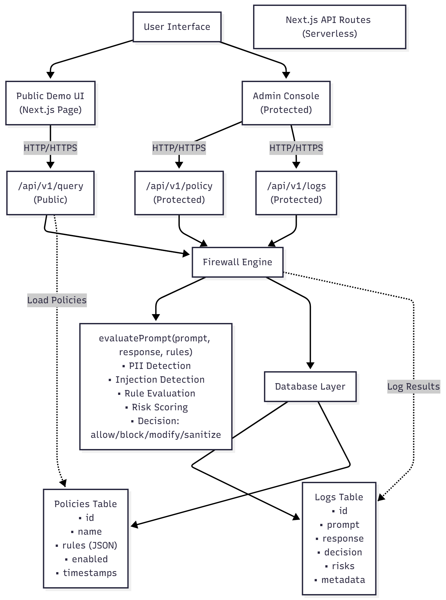

# Creating a Visual Architecture Diagram

This guide explains how to create a visual architecture diagram from the text-based diagram in `ARCHITECTURE.md`.

## Option 1: Using Mermaid (Recommended - Free & Easy)

### Step 1: Use the Mermaid file
A Mermaid diagram file (`ARCHITECTURE.mmd`) has been created. You can:

**Online (Easiest):**
1. Go to [Mermaid Live Editor](https://mermaid.live/)
2. Copy the contents of `ARCHITECTURE.mmd`
3. Paste into the editor
4. Click "Download PNG" or "Download SVG"

**VS Code:**
1. Install the "Markdown Preview Mermaid Support" extension
2. Open `ARCHITECTURE.mmd`
3. Use the preview to see the diagram
4. Export as PNG/PDF

**Command Line:**
```bash
# Install Mermaid CLI
npm install -g @mermaid-js/mermaid-cli

# Generate PNG
mmdc -i ARCHITECTURE.mmd -o ARCHITECTURE.png

# Generate PDF
mmdc -i ARCHITECTURE.mmd -o ARCHITECTURE.pdf
```

## Option 2: Using Draw.io / diagrams.net (Free, Web-based)

1. Go to [diagrams.net](https://app.diagrams.net/) (formerly Draw.io)
2. Create a new diagram
3. Use the following structure:

**Components to add:**
- **User Interface Layer:**
  - Public Demo UI (Rectangle, blue)
  - Admin Console (Rectangle, purple)

- **API Layer:**
  - /api/v1/query (Rectangle, green - Public)
  - /api/v1/policy (Rectangle, orange - Protected)
  - /api/v1/logs (Rectangle, orange - Protected)
  - /api/auth/* (Rectangle, red - Auth)

- **Firewall Engine:**
  - PII Detection (Rectangle, cyan)
  - Injection Detection (Rectangle, cyan)
  - Rule Evaluation (Rectangle, cyan)
  - Risk Scoring (Rectangle, cyan)

- **Data Layer:**
  - Prisma ORM (Rectangle, indigo)
  - Database (Cylinder, teal)
  - Logs Table (Rectangle, gray)
  - Policies Table (Rectangle, gray)

**Connections:**
- UI → API (arrows)
- API → Firewall Engine (arrows)
- Firewall Engine → Data Layer (arrows)
- Data Layer internal connections (arrows)

4. Export as PNG or PDF: File → Export as → PNG/PDF

## Option 3: Using Lucidchart (Professional, Paid)

1. Sign up at [Lucidchart](https://www.lucidchart.com/)
2. Create a new diagram
3. Use the same structure as Draw.io
4. Export as PNG/PDF

## Option 4: Using Excalidraw (Free, Hand-drawn Style)

1. Go to [Excalidraw](https://excalidraw.com/)
2. Create a new drawing
3. Draw the architecture using the text diagram as reference
4. Export as PNG

## Option 5: Using PlantUML (Text-based, Generates Visuals)

1. Install PlantUML: `npm install -g node-plantuml`
2. Create a `.puml` file with the architecture
3. Generate: `puml generate ARCHITECTURE.puml -o ARCHITECTURE.png`

## Quick Start (Recommended)

**Easiest method - Mermaid Online:**

1. Open `ARCHITECTURE.mmd` in this repository
2. Copy all contents
3. Go to https://mermaid.live/
4. Paste the code
5. Click "Download PNG" or "Download SVG"
6. Save as `ARCHITECTURE.png` or `ARCHITECTURE.pdf`

**For PDF:**
- Download as SVG from Mermaid Live
- Use an online SVG to PDF converter
- Or use Inkscape (free): `inkscape ARCHITECTURE.svg --export-pdf=ARCHITECTURE.pdf`

## Diagram Structure Reference

```
User Interface
    ↓
API Routes (Serverless)
    ↓
Firewall Engine
    ↓
Database (via Prisma ORM)
```

**Key Components:**
- **Frontend**: Next.js pages (Public Demo + Admin)
- **API**: Next.js API routes (public query + protected admin endpoints)
- **Engine**: Firewall logic (detection, evaluation, scoring)
- **Database**: Prisma ORM → SQLite/PostgreSQL

## Tips

1. **Colors**: Use consistent colors for each layer (UI=blue, API=green/orange, Engine=cyan, Data=indigo/teal)
2. **Labels**: Include clear labels for each component
3. **Arrows**: Show data flow direction
4. **Grouping**: Group related components visually
5. **Legend**: Add a legend if using color coding

## Final Output

Save the visual diagram as:
- `ARCHITECTURE.png` (for README and documentation)
- `ARCHITECTURE.pdf` (for formal documentation)

Then update `README.md` to reference the visual diagram:
```markdown
## 🏗️ Architecture



See [ARCHITECTURE.md](./ARCHITECTURE.md) for detailed system architecture.
```

